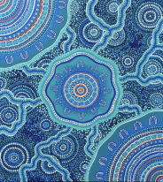
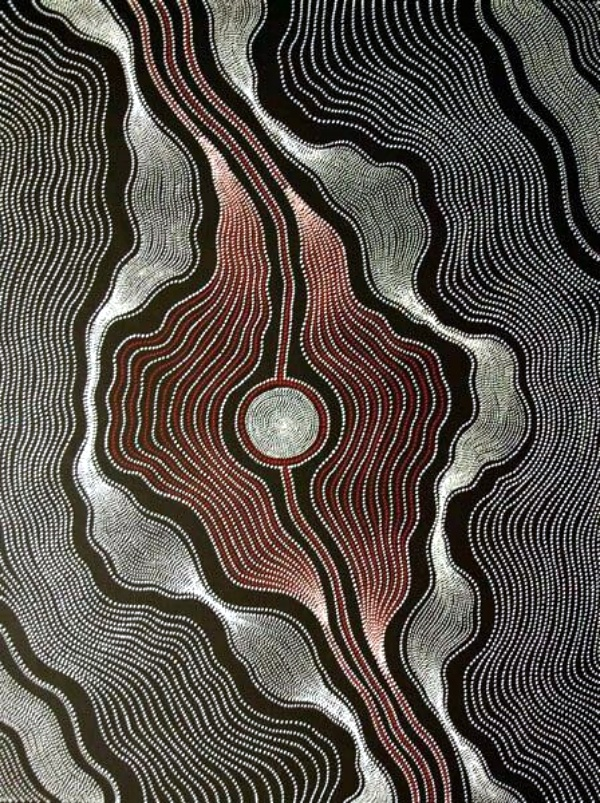
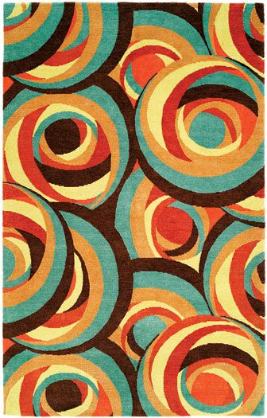
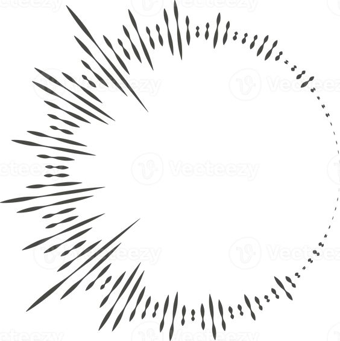

# sliu0991_9103MajorProject_tut8

# Part 1: Instruction

1. Refresh the page to get random colour big circles.
2. Click the button on the bottom of the page and wait the music to start. 

# Part 2: Details of my individual approach to animating the group code.

1. I chose audio to use the level or frequency content of an audio track to animate my group work.
2. - The scale of the concentric circles will be changed dynamically with the music. 
- The colour of the biggest circle will be random through refreshing the page
- And the wavyline on the background will also be animated to move with the music. 
- The rhythm will create unique effect as the stroke of the lines is continuously changing and the scale is changing which are different to my group members. 
- Creating circular frequency bands that has the gradient colour from white to orange around r2 circle.

# Part 3: Inspiration and References

The inspiration came from the Aboriginal art, as I want to present the moves of the wave. The scaling of the wave should be changed through the background music. And I got some inspiration from the circle art. By making the circle size changed with the music, I can create the effect of circles overlays with each other. As I am animating with sound, I would to visualise the frequency band as a circular shape around the inner circle.

I also got inspiration from week 11 tutorial on Canvas, as it taught me how to use sound file controlling shape class and add circular frequency bands using FFT. 

# Part 4: Technical explanation
I preloaded a sound file as the background music, and then added a button to play or pause. I set the colour of the biggest circle to random using rgb colour from 0-255. Then I used amplitude analyzer to measure the volume of the music, to animate the size and the stroke of the wavy lines in the background. After that, I use 'rms' value to adjust 'circlediameter' and pass the changing to the biggest circle class to make it move with the sound. At the end, I added a circular display base on the frequency band using FFT with smooth transitions. Using the base radius for the inner circle to identify the starting place of the frequency bands.And then I created gradient colour from white to orange using 'map' function. 

# Part 5: References
Holly Sanders art. (n.d.). Holly Sanders art [Illustration]. Pinterest. https://www.pinterest.com.au/pin/70437487889304/

Kelman, A. (2017, July 12). 40 Complex Yet Beautiful Aboriginal Art Examples [Artwork]. Bored Art. 
https://www.boredart.com/2017/07/complex-yet-beautiful-aboriginal-art-examples.html

Interior design. (n.d.). Korean Crisis Finds Expression in John Marx Drawing - Interior Design [Illustration]. Pinterest. https://www.pinterest.com.au/pin/405957353896499040/

Vecteezy. (n.d.). Circle audio wave. Circular music sound equalizer. Abstract radial radio and voice volume symbol [Illustration]. Pinterest. https://www.pinterest.com.au/pin/328410997843467909/